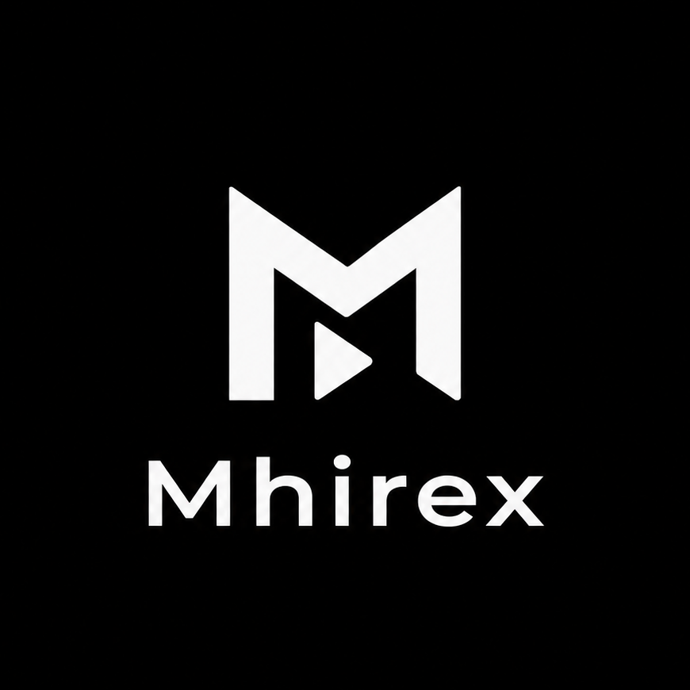

# MhireX

<div align="center">
  
  <br/>
  <br/>
  <br/>

  <a href="https://github.com/Preet3627/Mhirex">
    
  </a>
  <a href="LICENSE">
    
  </a>
  <br/>
  <br/>
  <a href="https://github.com/Preet3627/Mhirex/releases/latest">
    
  </a>
  <a href="https://f-droid.org/packages/com.tharunbirla.librecuts/">
    
  </a>
  <a href="https://apps.obtainium.imranr.dev/redirect?r=obtainium://add/https://github.com/Preet3627/Mhirex">
    
  </a>
  <a href="https://discord.gg/gwr3nE7YW">
    
  </a>
  <a href="https://hosted.weblate.org/engage/librecuts/">
    
  </a>
</div>

<br/>

**MhireX** is a free, open-source video editor for Android that prioritizes simplicity, efficiency, and privacy. Built for seamless performance, it empowers creators to easily select, edit, and export watermark-free videos locally on their device.

The app idea comes from [@_fivetriple.8_](https://www.instagram.com/_fivetriple.8_/). It was developed just for him by **Preet Patel**, with [@il__mehul_patel__li](https://www.instagram.com/il__mehul_patel__li/) also connected to the project. MhireX is based on LibreCuts by Tharun Birla and retains the upstream MIT license and attribution. See [`NOTICE`](NOTICE) and [`ASSETS.md`](ASSETS.md) for third-party and release notices.

---

## ✊ Keep Android Open

[](https://keepandroidopen.org/)

Google's mandatory developer verification policy goes into effect in **September 2026** (in just a few months). This mandate requires all independent developers to submit government ID and centrally register with Google, threatening user privacy, sideloading freedom, and the distribution of free and open-source software (FOSS) on Android. 

Help resist this gatekeeping and support the movement at [keepandroidopen.org](https://keepandroidopen.org/).

---

## 🚀 Features

- **Trim** - Remove unwanted parts from the beginning or end of a video clip with a real-time timeline control.
- **Overlays** - Place text, stickers, images, GIFs, and video overlays on top of video clips to create engaging content. Includes support for continuous media looping.
- **Masking** - Apply various mask shapes to your overlays for creative effects.
- **Chroma Key** - Remove backgrounds from any overlay using the green screen effect.
- **Keyframes** - Animate overlays across the screen with keyframe support.
- **Subtitles (Captions)** - Import custom `.srt` subtitle files with a dedicated toolbar slider for resizing and fully interactive touch-based positioning directly on the video preview.
- **Layer Management** - Easily reorder overlay layers to control what renders on top.
- **Audio** - Manage soundtracks effortlessly by importing custom music or audio tracks, recording voice overs, applying audio ducking and fades, amplifying volume up to 200%, and muting original audio.
- **Audio Export** - Export your project's entire audio mix as a standalone MP3 file.
- **Snapshots** - Capture and save high-quality frame grabs (snapshots) directly from the video editor.
- **Crop** - Adjust the aspect ratio of a video with custom cropping support.
- **Merge** - Combine multiple video segments into a continuous sequence with drag-to-rearrange functionality.
- **Transition** - Apply transitions with animated visual previews in the toolbar.
- **Speed** - Change the speed of a video clip using a custom speed slider for granular control.
- **Adjust & Filters** - Modify video brightness, contrast, saturation, and apply color filters.
- **Canvas Background** - Add a blurred background or a solid color for a cohesive look when your video aspect ratio does not match the project frame.
- **Reverse** - Reverse video playback.
- **Timeline Organization** - Enhanced editing with snapping functionality, overlay duplication, freeze frame actions, and improved UI visual styling.
- **Project Save & Import** - Save non-destructive project state as a `.lcprj` file to save and reopen editable project files anytime.
- **Freehand Drawing** - Draw directly on top of video clips with custom brush color and stroke controls.
- **Custom Fonts** - Import `.ttf` or `.otf` font files to customize text overlay typography.
- **Fullscreen Preview** - Switch to true fullscreen preview mode with expanded timeline view and overlay controls.
- **Android 13+ Themed Icon** - Supports native monochrome adaptive icons for Android 13+ system themes.
- **Hardware Acceleration** - Super-fast and reliable video exports using device hardware-accelerated `h264_mediacodec` encoding (with seamless automatic fallback to software encoding for maximum device compatibility) and accurate FFmpeg progress calculation.

## 📱 Screenshots

<div align="center">
  <table>
    <tr>
      <td align="center"></td>
      <td align="center"></td>
      <td align="center"></td>
      <td align="center"></td>
    </tr>
    <tr>
      <td align="center"><b>Home Screen</b></td>
      <td align="center"><b>Editor Screen</b></td>
      <td align="center"><b>Audio Import</b></td>
      <td align="center"><b>Timeline</b></td>
    </tr>
  </table>
</div>

## 💖 Support MhireX

MhireX is a personal project built with passion and provided for free. If it helped you create something amazing, please star the new repository and follow the people behind the app.

<div align="center">
  <br/>
  <a href="https://github.com/Preet3627/Mhirex"></a>
  &nbsp;&nbsp;
  <a href="https://www.instagram.com/_fivetriple.8_/"></a>
  <br/>
  <br/>
</div>

## 🛠️ Getting Started

### Prerequisites

- Android Studio
- Android SDK

### Installation

1. **Clone the repository**:
   ```bash
   git clone https://github.com/Preet3627/Mhirex.git
   ```
2. **Open the project in Android Studio**:
   - Launch Android Studio and select "Open an existing Android Studio project."
   - Navigate to the cloned directory and select it.
3. **Build the project**:
   - Click on "Build" in the menu, then select "Make Project."
4. **Run the app**:
   - Connect an Android device or start an emulator.
   - Click on the "Run" button in Android Studio.

## 🔒 Permissions

MhireX uses the following permissions to function properly:

- **READ_MEDIA_AUDIO/VIDEO/IMAGES**: For accessing media files on devices running Android 13 (API level 33) and above.
- **READ_EXTERNAL_STORAGE**: To read media on older Android versions.
- **POST_NOTIFICATIONS**: To show export and proxy-generation notifications.
- **RECORD_AUDIO**: To record voice-over audio.

Exports are published through Android MediaStore or a user-selected SAF folder; the app does not request legacy public-directory write access.

## 🔧 Troubleshooting & Support

If you encounter any export failures, codec errors, or unexpected crashes during your editing workflow:
- Refer to our comprehensive [Error Codes & Troubleshooting Guide](https://github.com/tharunbirla/LibreCuts/wiki/Error-Codes-&-Troubleshooting) on the Wiki.
- Join our [Discord Community](https://discord.gg/gwr3nE7YW) for real-time support, suggestions, and app updates.

## 🤝 Contributing

Contributions are welcome! If you have suggestions or improvements, feel free to create a pull request or open an issue.

1. Fork the repository.
2. Create a new branch for your feature or bug fix.
3. Commit your changes.
4. Push to the branch.
5. Submit a pull request.

## 📝 License

This project is licensed under the MIT License. See the [LICENSE](LICENSE) file for details.
